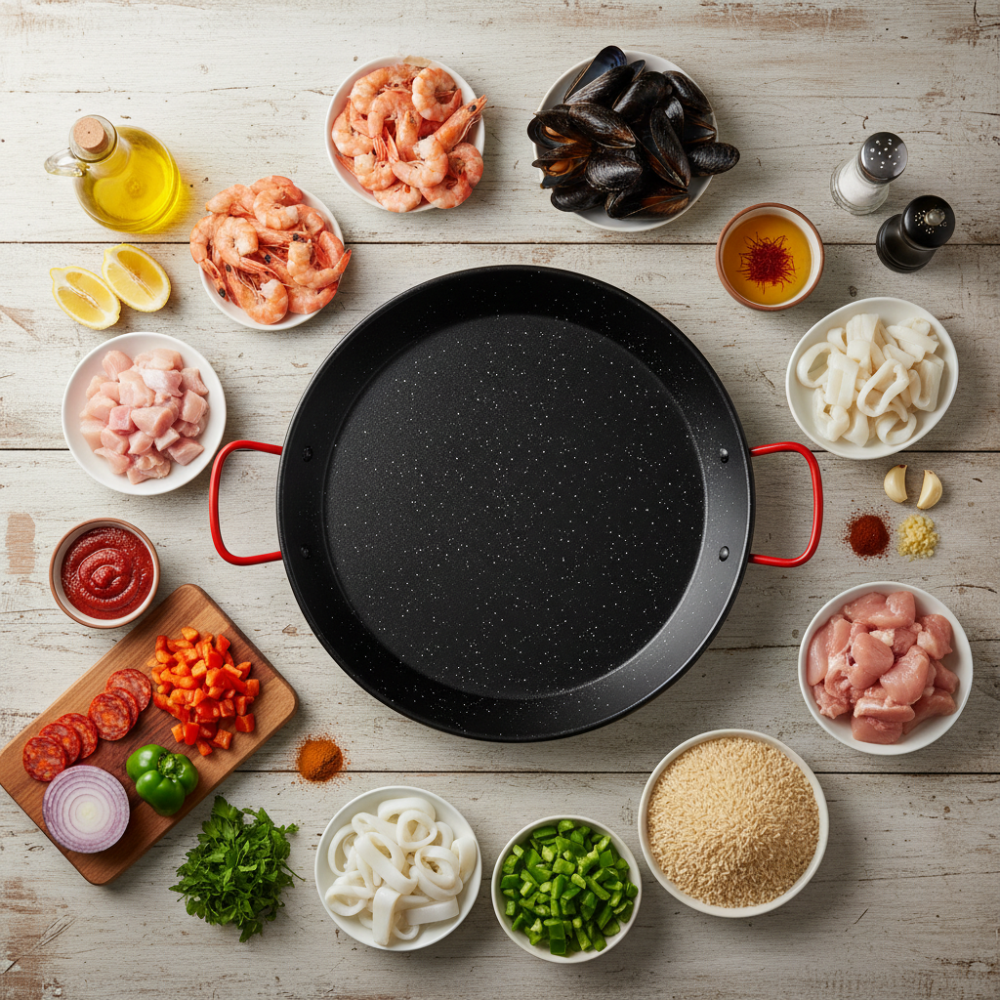
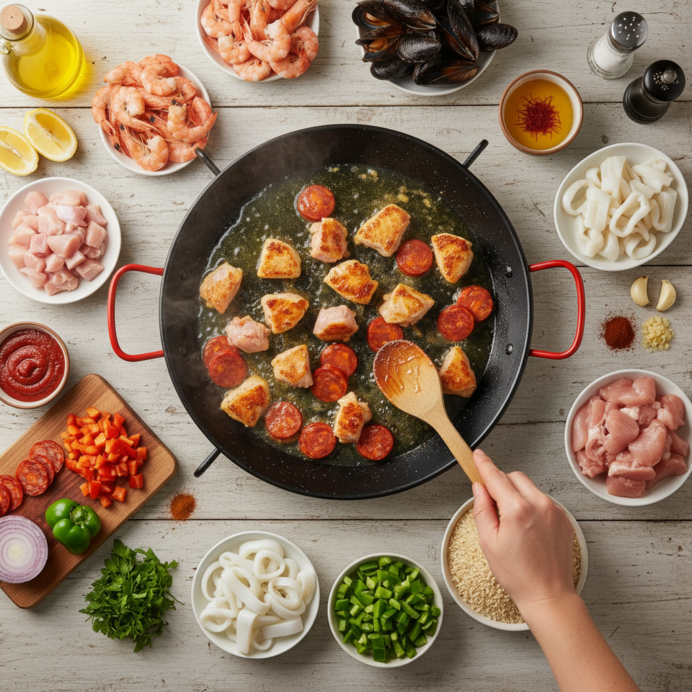
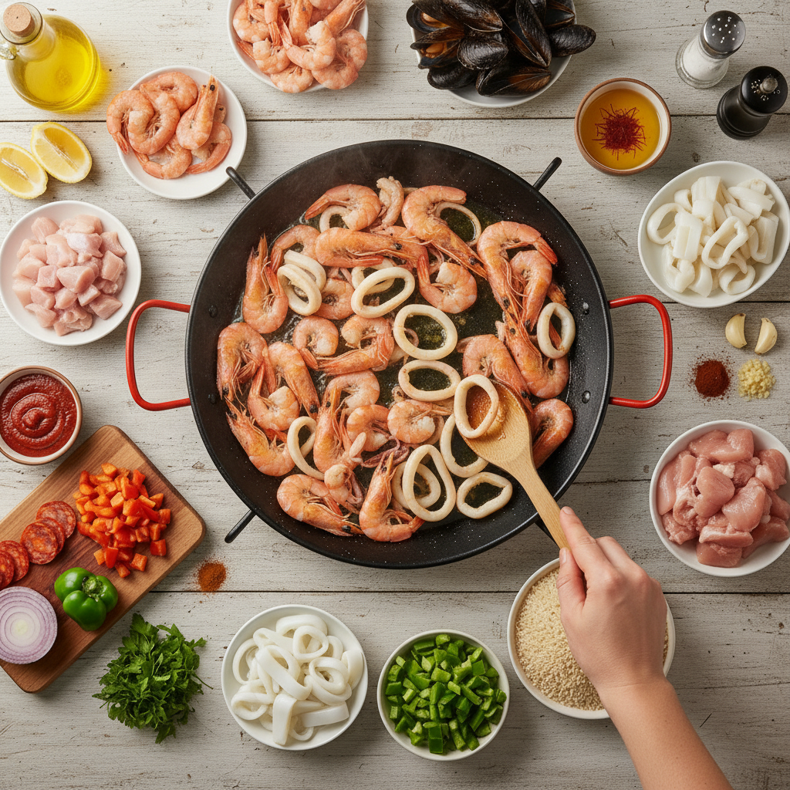
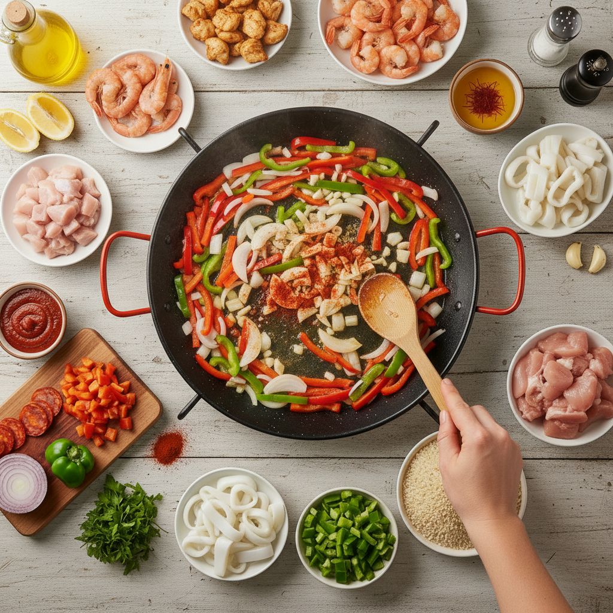
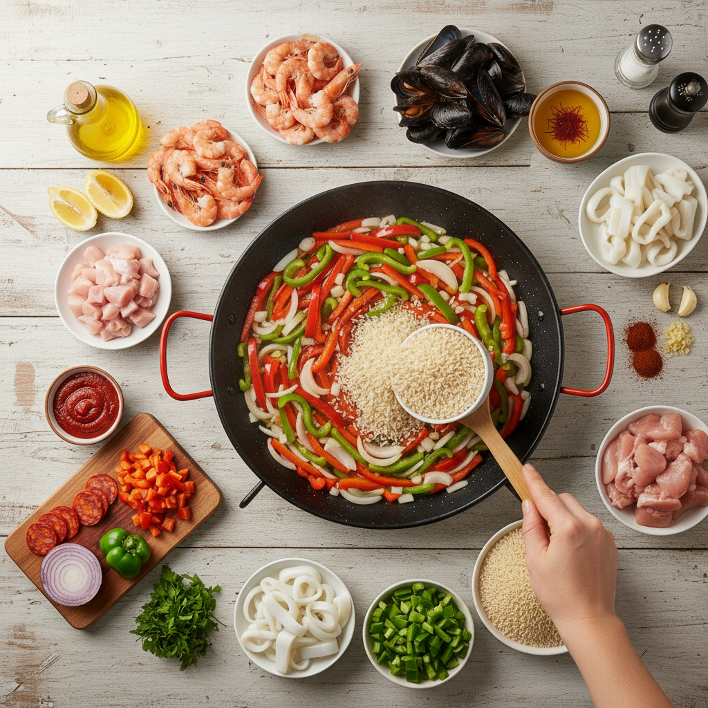
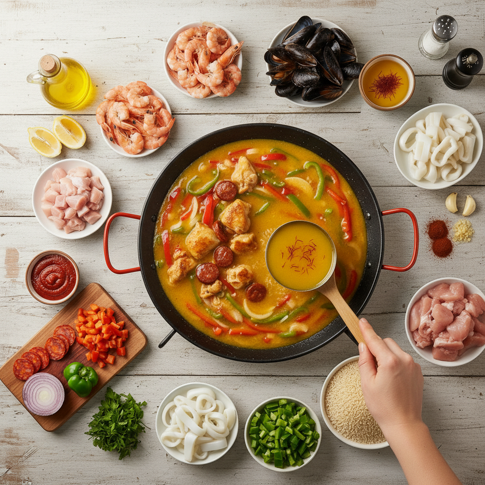
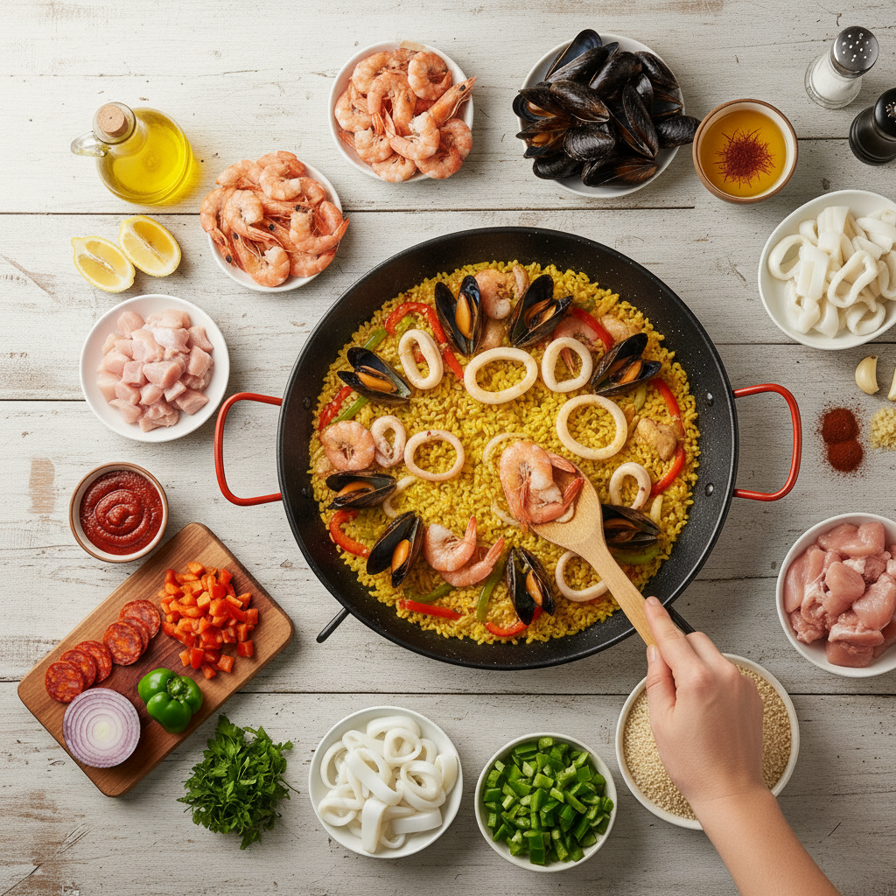
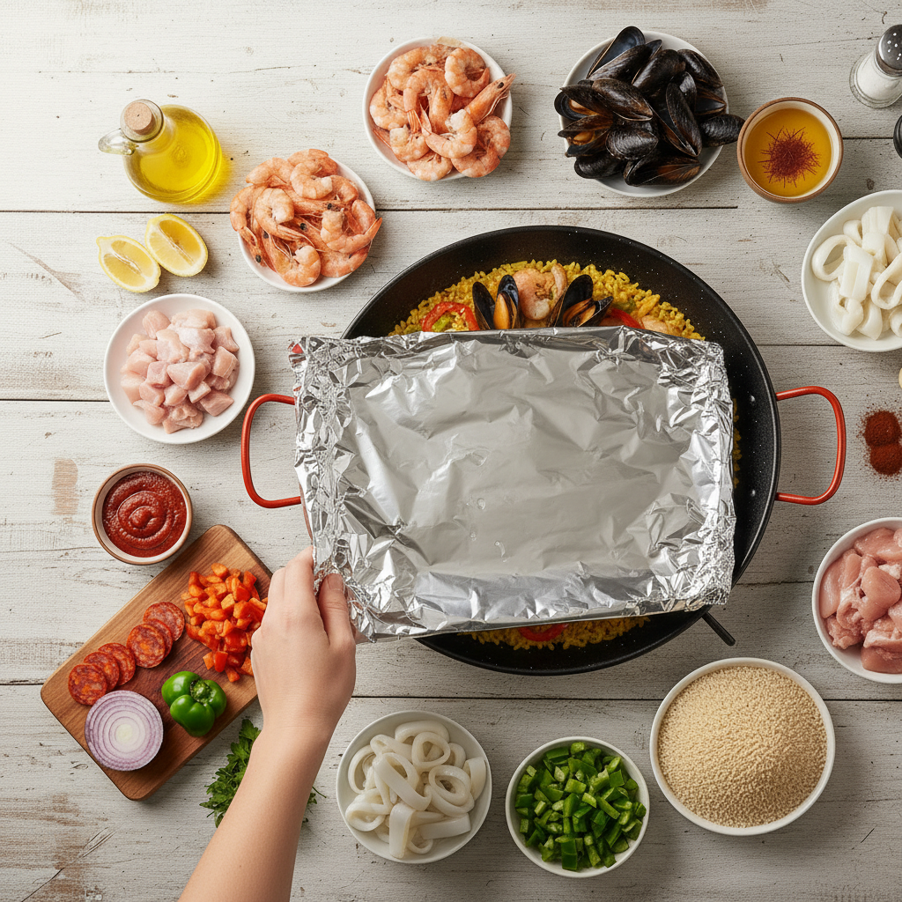
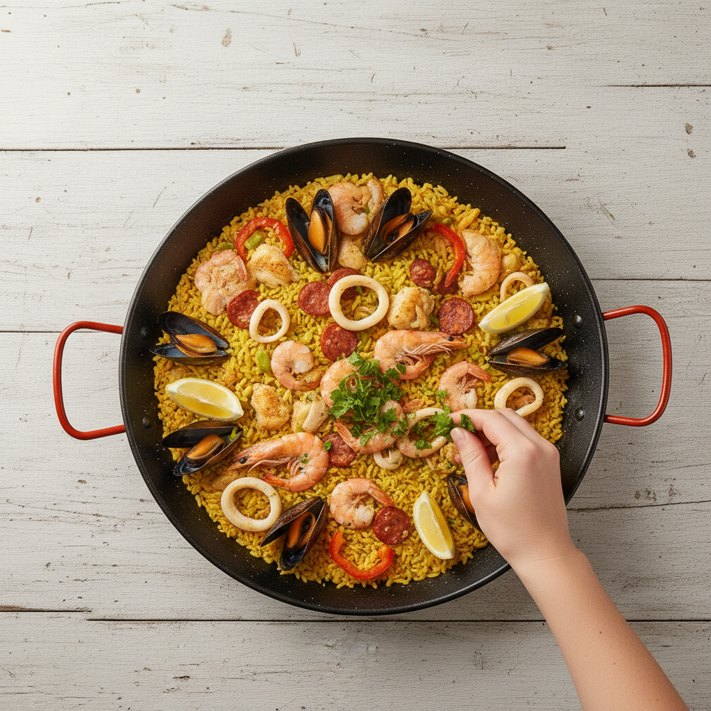

好的，这是一份制作美味西班牙海鲜饭（Paella）的食谱，每个步骤都配有插图。

---

### 西班牙海鲜饭（Paella）食谱

西班牙海鲜饭是西班牙的经典美食，以其丰富的口感和鲜艳的色彩而闻名。制作一份正宗的海鲜饭需要一些耐心，但最终的美味绝对值得！

**准备时间：** 20分钟
**烹饪时间：** 40-50分钟
**份量：** 4-6人份

---

**所需食材：**

*   短粒米（Paella米或日本珍珠米）：2杯
*   鸡高汤（或海鲜高汤）：4杯
*   大虾：250克，去壳去虾线
*   贻贝（青口）：250克，洗净
*   鱿鱼：200克，切圈
*   鸡腿肉：200克，切块
*   西班牙香肠（Chorizo）：100克，切片（可选）
*   洋葱：1个，切丁
*   红椒：1个，切条
*   青椒：1个，切条
*   蒜：3瓣，切末
*   番茄酱（或新鲜番茄切丁）：3汤匙
*   藏红花：一小撮（约1/4茶匙），用少量热水浸泡10分钟
*   烟熏甜椒粉（Paprika）：1茶匙
*   橄榄油：3汤匙
*   盐：适量
*   黑胡椒：适量
*   柠檬：半个，切角，用于装饰
*   新鲜欧芹：少量，切碎，用于装饰

---

**制作步骤：**

**1. 准备食材：**
将所有食材清洗、切好，并准备就绪。鸡肉和香肠切块，大虾去壳去虾线，贻贝洗净，鱿鱼切圈，蔬菜切丁或切条。将藏红花用少量热水浸泡，使其释放颜色和香气。 **2. 炒制肉类和海鲜：**
取一个宽大的平底锅或Paella锅（Paella Pan），倒入2汤匙橄榄油，中高火加热。先放入鸡肉和西班牙香肠，炒至表面金黄，取出备用。 在同一个锅中，加入大虾和鱿鱼圈，快速翻炒至变色，大约1-2分钟。取出备用，不要过度烹饪。 **3. 炒香蔬菜：**
锅中再加入1汤匙橄榄油，放入洋葱丁、红椒条和青椒条，翻炒约5分钟，直至变软。接着加入蒜末和烟熏甜椒粉，继续翻炒1分钟，直到香气散发。 **4. 加入番茄酱和米：**
将番茄酱（或新鲜番茄丁）加入锅中，翻炒2-3分钟。然后倒入生米，翻炒1-2分钟，让米粒均匀裹上油和酱汁，这样可以防止米饭煮得过于黏稠。 **5. 加入高汤和藏红花：**
将高汤倒入锅中，加入之前浸泡好的藏红花水，用盐和黑胡椒调味。搅拌均匀，然后将之前炒好的鸡肉和香肠放回锅中。 **6. 慢炖与铺排：**
将火力调至中低，让米饭在没有盖子的锅中慢炖。在炖煮过程中尽量避免搅拌，让米饭均匀受热，并形成Paella特有的锅巴（socarrat）。炖煮约15-20分钟，直到米饭吸收了大部分汤汁。

在炖煮的最后5-10分钟，将大虾、鱿鱼和贻贝铺排在米饭表面。 **7. 完成与静置：**
继续炖煮，直到贻贝开口，大虾变红，米饭熟透且汤汁收干。如果米饭还有点硬，可以适量再加一点高汤。
将锅从火上移开，用锡纸或干净的布盖住，静置5-10分钟，让米饭充分吸收余温，口感更佳。 **8. 装饰与享用：**
打开锡纸，用新鲜欧芹碎和柠檬角装饰。将海鲜饭直接从锅中盛出享用，与亲朋好友分享这道美味的西班牙大餐！ 